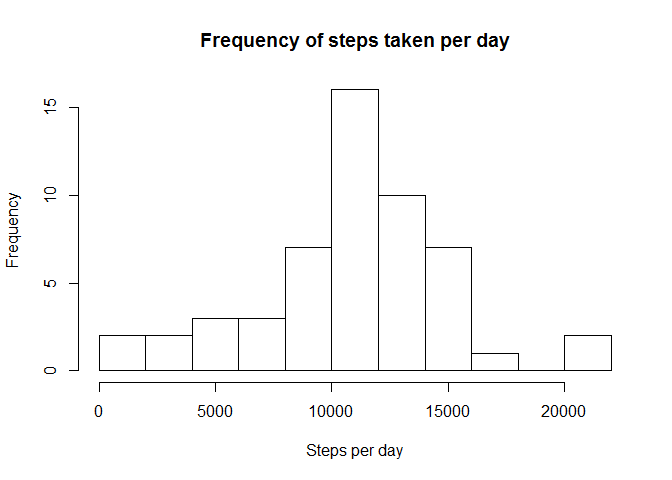
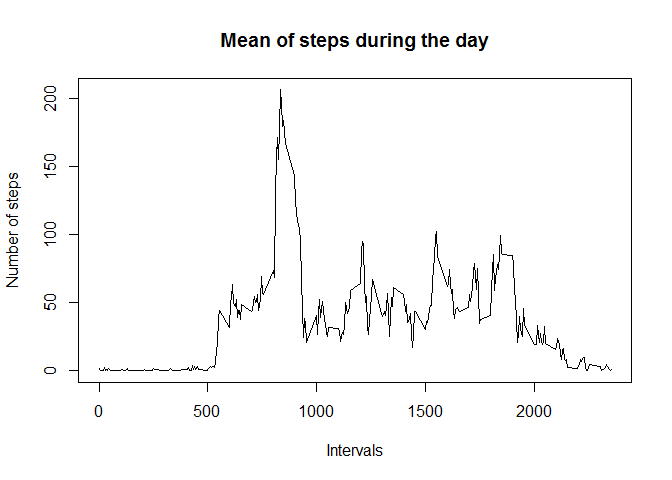
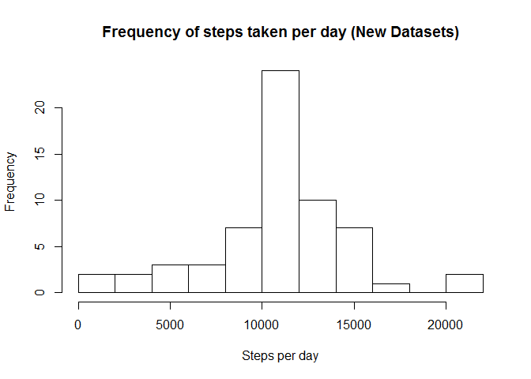

# Reproducible Research: Peer Assessment 1


## Loading and preprocessing the data

The first step consists in load the data from the zip file, available in the folder.


```r
#Unzip the file and load the data
unzip(zipfile="activity.zip")
data_raw <- read.csv("activity.csv")
```


## What is mean total number of steps taken per day?

For the first considerations I will ignore the NA value.

At first I have calculate the number of step taken per day:


```r
num_step_day <- aggregate(data_raw$steps, by=list(data_raw$date), sum)
```


Here we can see an histogram that represents the frequency of total number of steps taken each day:


```r
hist(num_step_day$x, main="Frequency of steps taken per day", xlab="Steps per day", breaks=10)
```

 


Eventualy I have calculated the mean and the median of the total number of steps taken per day:


```r
mean_step_day <- mean(num_step_day$x, na.rm =TRUE)
median_step_day <- median(num_step_day$x, na.rm =TRUE)
```

The mean of steps taken per day is: 

```r
format(mean_step_day, digits=2, nsmall=1)
```

```
## [1] "10766.2"
```

The median of steps taken per day is: 

```r
format(median_step_day, digits=2, nsmall=1)
```

```
## [1] "10765"
```


## What is the average daily activity pattern?

For this point I made a time series plot of the 5-minute interval (x-axis) and the average number of steps taken, averaged across all days (y-axis):


```r
mean_step_interval <- aggregate(data_raw$steps, by=list(data_raw$interval), FUN=mean, na.rm=TRUE) 

plot(mean_step_interval$Group.1, mean_step_interval$x, type="l", xlab="Intervals", ylab="Number of steps", main="Mean of steps during the day")
```

 


Eventualy I have calculated the 5-minute interval that contains the maximum number of steps (on average across all the days in the dataset):


```r
max_step_interval <- max(mean_step_interval$x, na.rm=TRUE)
max_interval <- mean_step_interval[mean_step_interval$x == max_step_interval, 1]
```

The 5-minute interval with the maximum number of steps in average is: 

```r
max_interval
```

```
## [1] 835
```


## Imputing missing values


For the third question I have calculated the number of missing values in the datasets:

```r
num_na_value <- sum(as.numeric(is.na(data_raw$steps)))
```

The total number of missing values in the dataset is: 

```r
num_na_value
```

```
## [1] 2304
```

To filling in all the missing values I have decided to replace them with the mean for the corresponding 5-minute interval:

```r
data_mod<-data_raw

for (i in 1:length(data_raw$steps)){
        
        if (is.na(data_mod$steps[i])){
        
                data_mod$steps[i] <- mean_step_interval$x[mean_step_interval$Group.1 == as.numeric(data_mod$interval[i]) ]
        }
}
```


After creating a new datasets with the new values, I plotted an histogram of the total number of steps taken each day:

```r
num_step_day_mod <- aggregate(data_mod$steps, by=list(data_mod$date), sum)

hist(num_step_day_mod$x, main="Frequency of steps taken per day (New Datasets)", xlab="Steps per day", breaks=10)
```

 


Eventualy I have calculated the mean and the median of the total number of steps taken per day:

```r
mean_step_day_mod <- mean(num_step_day_mod$x)
median_step_day_mod <- median(num_step_day_mod$x)
```

The mean of steps taken per day for the new datasets is: 

```r
format(mean_step_day_mod, digits=2, nsmall=1)
```

```
## [1] "10766.2"
```
mean from original datasets: 

```r
format(mean_step_day, digits=2, nsmall=1) 
```

```
## [1] "10766.2"
```
The median of steps taken per day for the new datasets is: 

```r
format(median_step_day_mod, digits=2, nsmall=1)
```

```
## [1] "10766.2"
```
Median from original datasets: 

```r
format(median_step_day, digits=2, nsmall=1)
```

```
## [1] "10765"
```

The impact of imputing missing data on the estimates of the total daily number of steps is that the median becomes equal to the mean.


## Are there differences in activity patterns between weekdays and weekends?

To find differences in activity betweeen weekdays and weekends I converted the date in numeric day (0-6 starting from Sunday) and convert them in a factor with 2 levels:

```r
# Obtain the correct day (numeric)
data_mod$day <- as.POSIXlt(data_mod$date)$wday


# Convert in weekday-weekend
data_mod$day <- gsub(1, "weekday", data_mod$day)
data_mod$day <- gsub(2, "weekday", data_mod$day)
data_mod$day <- gsub(3, "weekday", data_mod$day)
data_mod$day <- gsub(4, "weekday", data_mod$day)
data_mod$day <- gsub(5, "weekday", data_mod$day)

data_mod$day <- gsub(6, "weekend", data_mod$day)
data_mod$day <- gsub(0, "weekend", data_mod$day)


#Convert to factor
data_mod$day <- as.factor(data_mod$day)
```


Eventually I made a panel plot containing a time series plot of the 5-minute interval (x-axis) and the average number of steps taken, averaged across all weekday days or weekend days (y-axis); for this step I used the lattice package.

```r
mean_step_day <- aggregate(data= data_mod, steps ~ interval + day, FUN=mean)

library(lattice)
xyplot(steps ~ interval | day, data = mean_step_day, layout=c(1,2), ylab="Number of steps", xlab="Interval", type = "l")
```

 

